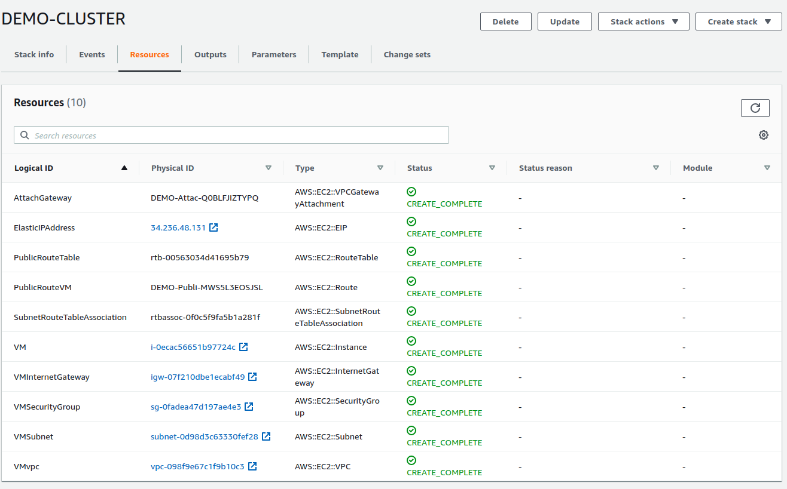
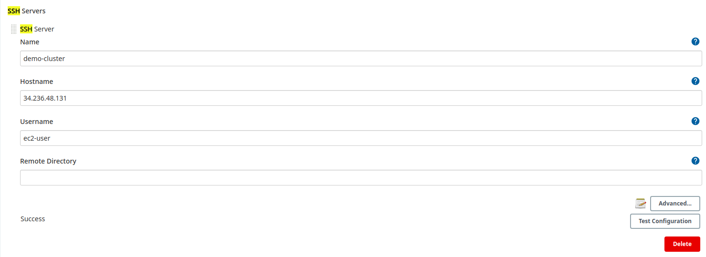
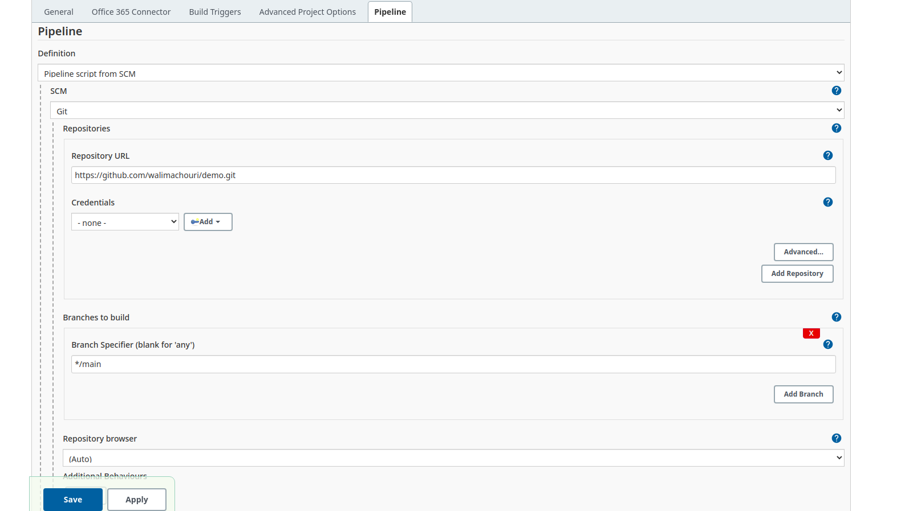
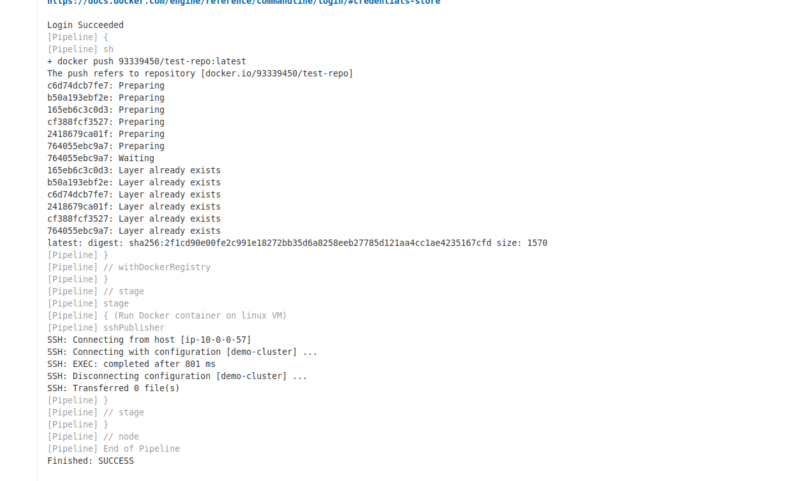
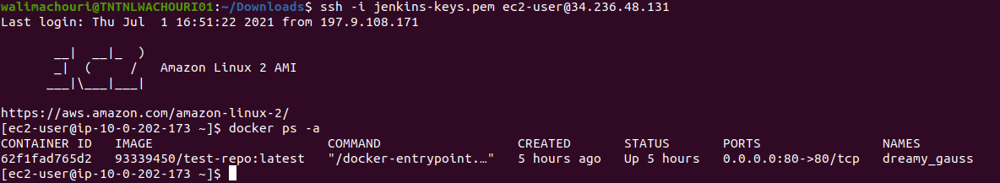
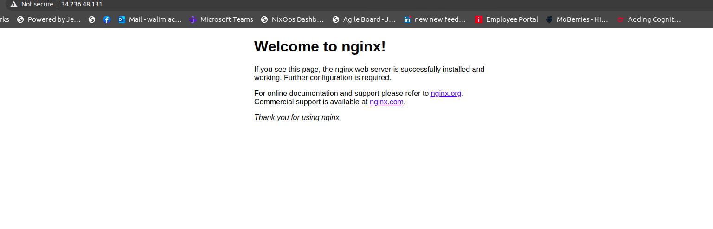

# Automation Tasks - Grid Singularity

## Requirements

- AWS Account
- AWS EC2 KeyPair
- (Optional) AWS CLI

## Usage

Deploy using the [CloudFormation designer](https://aws.amazon.com/cloudformation/) or by using the AWS CLI:

```bash
# Validate cloudformation template
aws cloudformation validate-template --template-body file://PATH/TO/singularity-formation.yaml

# Shell variables
STACK_NAME="DEMO-CLUSTER"
KEY_NAME="YOUR_KEY_PAIR"

# Create CloudFormation Stack with this template
aws --region us-east-1 cloudformation create-stack --stack-name $STACK_NAME --template-body file://PATH/TO/singularity-formation.yaml --parameters ParameterKey=KeyName,ParameterValue=$KEY_NAME
```

This cloudformation template will provision and ec2 instance with docker preinstalled.

## SSH into virtual machine

SSH into the virtual machine using the keyfile and the public provisioned Elastic IP Address.

```bash
ssh -i KEYFILE.pem ec2-user@x.x.x.x
```

# CI/CD Pipeline using Jenkins pipeline.

## Requirements

- Jenkins preinstalled(Publish over ssh and Docker plugins installed)

## Usage

- Setup a new ssh server in the configure system section to connect the provisioned instance (use the public ip and the keyfile generated by the cloudformation).
- Configure a docker-hub and integrate it to jenkins.
- update the jenkins to meet the instance creds_id, the docker-hub creds_id and the docker-hub repo name.
- Create a new pipeline job.
- Use git to fetch the Jenkinsfile script.
- Click build now.

The Jenkinsfile script will:

- Build the docker file.
- Push the image to the remote docker-hub.
- ssh to the remote instance , pull the latest image and run the docker container.

Go x.x.x.x (instance ip) you will get an nginx page.

# DEMO

### CloudFormation



### Jenkins ssh server setup



### Job configuration



### Job logs



### Docker container



### Nginx


